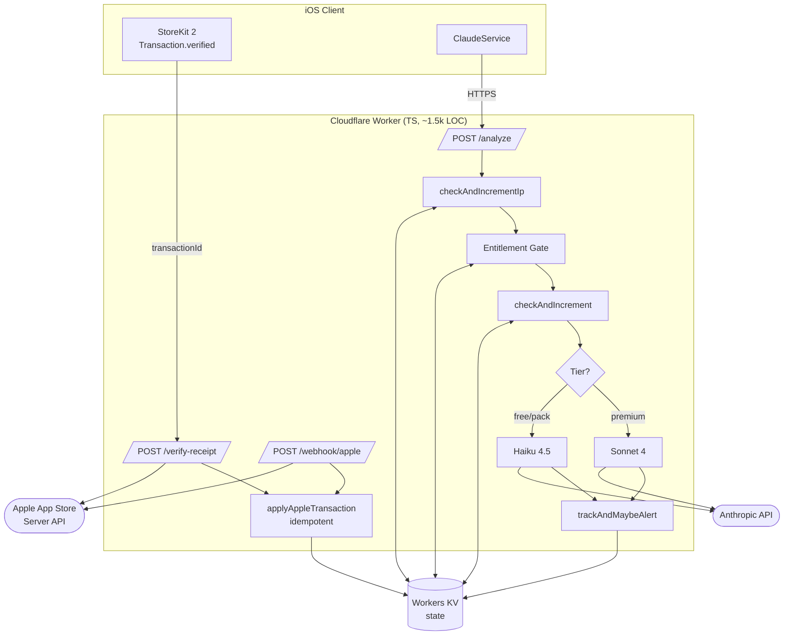
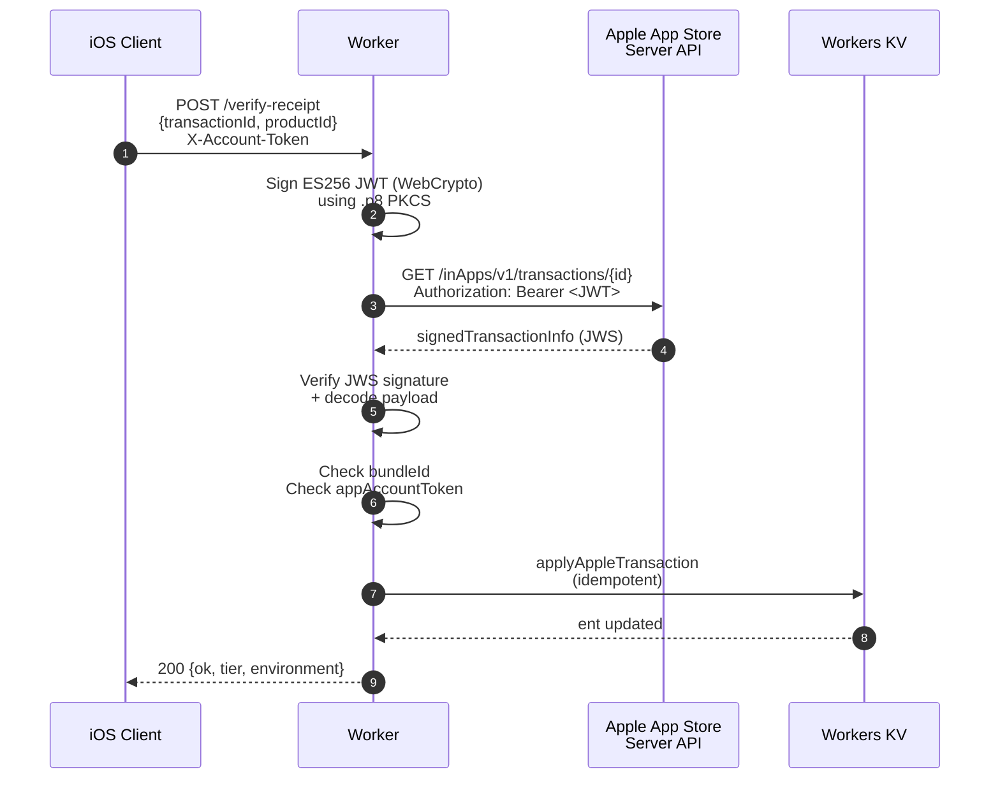

# 🐾 Carmel Worker — KittyScan Backend

[](https://www.typescriptlang.org)
[](https://workers.cloudflare.com)
[](https://anthropic.com)
[](https://developer.apple.com/storekit/)
[](LICENSE)

> Production-grade Cloudflare Worker that brokers Anthropic Claude vision
> calls for the [KittyScan iOS app](https://github.com/KittyScan/Kitty-Scan),
> with server-side Apple StoreKit verification, a tier-aware entitlement
> ledger, multi-layer rate limiting, and per-request cost tracking.

---

## Why this exists

KittyScan's iOS client never holds an API key. Every Claude vision request
goes through this Worker, which:

1. **Authenticates the device** (account-token + device-id headers).
2. **Decides the model** based on the user's verified subscription tier.
3. **Enforces a layered quota** so a single jailbroken client cannot
   drain the monthly Anthropic spend cap.
4. **Verifies Apple StoreKit purchases server-side** using the App Store
   Server API JWS payload as the trust anchor — a forged client report
   cannot grant entitlement.
5. **Tracks per-request token cost** in real time and fires a webhook
   alert before the spend ceiling hits.

`/analyze` p99 stays under ~3.5 s end-to-end (Claude vision dominates).

---

## System diagram



---

## Receipt verification flow



The four guards (signature, bundleId, appAccountToken, idempotency key)
together mean a forged receipt requires forging Apple's signature.

---

## Highlights

### Tier-aware model orchestration
A single header (`X-Tier`) decides between two Claude model classes:

```ts
const tier = (request.headers.get('X-Tier') ?? 'economy').toLowerCase();
const model = tier === 'premium'
  ? (env.MODEL || 'claude-sonnet-4-6')          // accuracy
  : 'claude-haiku-4-5-20251001';                // ~6× cheaper
```

The tier is signaled by the iOS client based on a server-verified StoreKit
transaction. A jailbroken client setting `X-Tier: premium` still falls
back to whatever the entitlement ledger proves they paid for.

### Three layers of abuse defense

| Layer | Key | Purpose |
|---|---|---|
| `checkAndIncrementIp` | `ip:<ip>:<hour>` | 20/hour ceiling — catches fresh-device-id enumeration from a single IP. |
| `checkAndIncrement` | `day:<deviceId>:<date>` + `month:<deviceId>:<month>` | Per-device daily / monthly quota — defense-in-depth. |
| Entitlement ledger | `ent:<accountToken>` | The real quota. Free-tier counter (`free:<accountToken>`) is keyed by an iCloud-synced UUID so deleting the app no longer resets the trial. |

All three back to the Anthropic Console hard $20/mo Spend Limit. Worst
case: an attacker who somehow bypasses every layer still hits Anthropic's
503 at $20.

### Per-request cost tracking with edge-triggered alerts

```ts
const cost = inTok * INPUT_PRICE_PER_TOKEN + outTok * OUTPUT_PRICE_PER_TOKEN;
const month = new Date().toISOString().slice(0, 7); // YYYY-MM
const key = `cost:${month}`;
const prev = parseFloat((await kv.get(key)) || '0');
const next = prev + cost;
await kv.put(key, next.toFixed(6), { expirationTtl: 86_400 * 70 });

// Edge-triggered: fires exactly once per month even if traffic
// stays above the line for the rest of the period.
if (prev < alertThresholdUsd && next >= alertThresholdUsd) {
  await sendAlert(webhook, month, next, env);
}
```

### Defensive verify-receipt
The Worker refuses to grant entitlement if the four Apple secrets aren't
configured (returns 503 rather than fail-open):

```ts
if (!e.APPLE_PRIVATE_KEY || !e.APPLE_BUNDLE_ID
    || !e.APPLE_KEY_ID  || !e.APPLE_ISSUER_ID) {
  console.warn('[verify-receipt] Apple secrets not configured');
  return json({ error: 'verification_unavailable',
                detail: 'apple_secrets_not_set' }, 503);
}
```

A misconfigured deploy stops payments rather than silently granting Pro
to everyone.

---

## Tech Stack

- **Runtime**: Cloudflare Workers (V8 isolate, edge-deployed)
- **Language**: TypeScript
- **Storage**: Workers KV (rate counters, entitlement ledger, cost ledger)
- **Crypto**: WebCrypto (ES256 JWT signing for Apple App Store Server API)
- **AI**: Anthropic Claude Sonnet 4 / Haiku 4.5 (vision + chat)
- **Tooling**: Wrangler, esbuild

---

## Layout

```
src/
├── index.ts                    # Entry, route dispatch, CORS, env typing
├── routes/
│   ├── analyze.ts              # /analyze — gate + Claude call + bookkeeping
│   ├── verify-receipt.ts       # /verify-receipt — Apple JWS verify
│   ├── apple-webhook.ts        # /webhook/apple — Apple subscription events
│   └── feedback.ts             # /feedback — user-reported bug/feedback ingest
└── lib/
    ├── anthropic.ts            # Claude API client + retry
    ├── apple-api.ts            # Apple App Store Server API HTTP wrapper
    ├── apple-jws.ts            # JWS verify + decode (incoming Apple payloads)
    ├── apple-jwt.ts            # JWT sign (outgoing Apple requests)
    ├── costs.ts                # Cost ledger + threshold-crossing alerts
    ├── entitlement.ts          # Tier ledger + Apple transaction application
    ├── http.ts                 # JSON helpers, CORS
    ├── ratelimit.ts            # Per-IP + per-device sliding windows in KV
    └── waf.ts                  # Hot-path block list
```

`src/` is ~1,500 lines of TypeScript.

---

## Deploy

```bash
# First time setup
npx wrangler login
npx wrangler kv:namespace create RATE_KV   # paste id into wrangler.toml

# Set the secrets (none of these touch the repo)
npx wrangler secret put ANTHROPIC_KEY
npx wrangler secret put APPLE_BUNDLE_ID
npx wrangler secret put APPLE_KEY_ID
npx wrangler secret put APPLE_ISSUER_ID
npx wrangler secret put APPLE_PRIVATE_KEY    # .p8 PEM body, single line

# Ship
npx wrangler deploy
```

---

## Notes

- All secrets are stored as Cloudflare Worker secrets via `wrangler secret put`,
  never in source.
- iOS client repo: <https://github.com/KittyScan/Kitty-Scan>

## License

[Source-available for portfolio review.](LICENSE)
